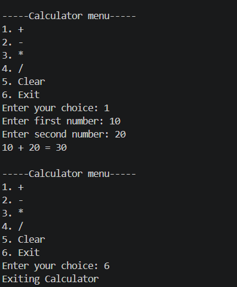

# Syntecxhub_Calculator_Project
Simple Command-line calculator built using Pyhton.
## Features:
- Addition
- Subtraction
- Multiplication
- Division
- Clear Option
- Exit Option
- Input Validation
## Internship Project
Completed as part of Syntecxhub internship.

## Sample Output

